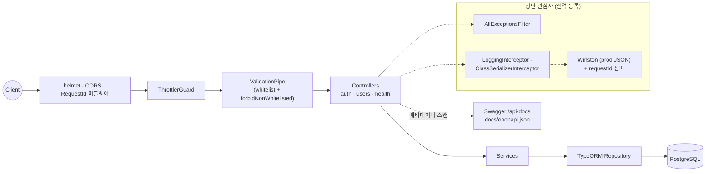

# NestJS API Template

JWT 인증, TypeORM, Swagger, 검증·로깅이 구성된 프로덕션 지향 NestJS 백엔드 템플릿.

> **상태:** 핵심 스캐폴딩 완료 — 부트스트랩(`main.ts`)·JWT 인증·users·health·전역 검증/예외
> 필터/로깅·TypeORM 마이그레이션·단위/e2e 테스트·Docker(PostgreSQL)·GitHub Actions CI 가 구성되어
> 있습니다. 미구현 항목은 하단 [Roadmap](#roadmap) 참고.

## Stack

NestJS · TypeScript · TypeORM · PostgreSQL · JWT · Swagger · class-validator · Winston · ESLint · Prettier · Husky

## Features

- JWT 인증 (bcrypt 해싱) — httpOnly 쿠키 발급 + Bearer 헤더 폴백
- RBAC + deny-by-default 전역 인증 가드 (`@Public()` 명시 예외)
- TypeORM + 마이그레이션
- Swagger 자동 문서화 + OpenAPI 스펙 export (`docs/openapi.json`, CI 드리프트 게이트; prod 비활성)
- DTO 검증 (`whitelist` + `forbidNonWhitelisted`) + 환경 변수 검증 (CORS prod fail-fast)
- Global Exception Filter (표준 에러 응답)
- helmet(HSTS) · CORS · rate limiting (로그인 강화) · payload 크기 제한
- Winston 로깅 + request id 전파 (`x-request-id`) + 로그인 감사 로그
- Health Check (Terminus) — `/health` · `/health/liveness` · `/health/readiness`
- graceful shutdown (`enableShutdownHooks`)
- ESLint + Prettier + Husky + gitleaks·Semgrep(SAST) + pnpm audit + SBOM + Dependabot

## Quick Start

> **요구사항:** Node `>=22.13` (pnpm 11.5.2 기준), corepack 활성화.

```bash
git clone https://github.com/<owner>/nestjs-api-template.git
cd nestjs-api-template
corepack enable             # pnpm 활성화 (packageManager 필드 기준 버전 고정)
pnpm install
cp .env.example .env        # 값 채우기
docker compose up -d postgres  # 로컬 DB
pnpm start:dev
```

Swagger: `http://localhost:3000/api-docs`

## Environment

```env
NODE_ENV=development
PORT=3000

DB_HOST=localhost
DB_PORT=5432
DB_NAME=app
DB_USERNAME=postgres
DB_PASSWORD=password

JWT_SECRET=             # openssl rand -base64 32 (16자 이상 필수)
JWT_EXPIRES_IN=1d

CORS_ORIGIN=            # 콤마 구분, 비우면 전체 허용
THROTTLE_TTL=60000      # rate limit 윈도(ms)
THROTTLE_LIMIT=100      # 윈도당 최대 요청 수
```

부팅 시 환경 변수를 검증하며, `JWT_SECRET`이 비어 있거나 너무 짧으면 실행을 중단합니다.

모드별 분리: `NODE_ENV` 에 따라 `.env.<mode>` → `.env` 순으로 로드합니다(기본 제공: `.env.development`). 값 예시는 `.env.example` 참고.

## Seed Account & Auth Flow

시드 스크립트가 기본 관리자 계정을 생성합니다 (비밀번호 `password`).

| 이메일            | 역할  | 비고      |
| ----------------- | ----- | --------- |
| admin@example.com | admin | 전체 권한 |

로그인 → 토큰 발급(httpOnly 쿠키 + 바디) → 인증이 필요한 엔드포인트 호출:

```bash
# 1) 로그인 → access_token 쿠키 발급(+ 폴백용 바디). 쿠키는 -c 로 저장
curl -c jar -X POST http://localhost:3000/auth/login \
  -H 'Content-Type: application/json' \
  -d '{"email":"admin@example.com","password":"password"}'

# 2a) 쿠키로 보호된 엔드포인트 호출(브라우저 기본 경로)
curl -b jar http://localhost:3000/users/me

# 2b) 또는 바디의 accessToken 으로 Bearer 폴백(모바일·서버 간 호출)
curl http://localhost:3000/users/me \
  -H 'Authorization: Bearer <accessToken>'

# 3) 로그아웃 → 쿠키 만료
curl -b jar -X POST http://localhost:3000/auth/logout
```

## API / Swagger

엔드포인트 탐색·시도는 Swagger UI(`/api-docs`, **production 에선 비활성**)에서. 보호된 라우트는
브라우저면 로그인 쿠키가 자동 전송되고, 도구 호출이면 우상단 **Authorize**에
`Bearer <accessToken>`을 넣어 호출합니다. 요청 바디는 DTO + class-validator로 검증되며,
검증 실패·예외는 아래 **표준 에러 응답** 형식으로 통일됩니다.

## Architecture



## Structure

```text
src
├── common      # filters, interceptors, decorators, guards, middleware(RequestId), context, pipes, enums(Role)
├── config      # env 검증(env.validation), 설정 로드(configuration), swagger 설정(swagger.config)
├── database    # database.module, data-source(CLI), migrations, seeds
├── logger      # winston 설정(+requestId) + LoggerModule
├── modules     # auth(JWT), users(role/RBAC), health(terminus — liveness/readiness)
├── app.module.ts  # + RequestIdMiddleware 등록
└── main.ts     # 부트스트랩 (전역 파이프/필터, helmet, CORS, Swagger, winston, shutdown hooks)
```

## Scripts

```bash
pnpm start:dev             # 개발 서버 (watch)
pnpm build                 # 컴파일 (nest build + tsc-alias 경로 별칭 변환)
pnpm lint                  # ESLint
pnpm format                # Prettier --write
pnpm test                  # 단위 테스트
pnpm test:e2e              # e2e 테스트 (testcontainers 가 PG 자동 기동 — Docker 데몬만 필요)
pnpm migration:generate src/database/migrations/<Name>  # 마이그레이션 생성
pnpm migration:run         # 마이그레이션 실행
pnpm seed                  # 기본 admin 계정 시드
pnpm openapi:generate      # docs/openapi.json 생성 (DB 불필요 — 프론트 타입 생성 소스)
```

> **DB 초기화 순서:** `docker compose up -d postgres` → `pnpm migration:run` → `pnpm seed`.
> 경로 별칭 `@/*` → `src/*` 는 `tsconfig`·Jest·런타임(`tsc-alias`/`tsconfig-paths`) 모두에 설정됩니다.

> **e2e 의 DB 격리:** e2e 는 testcontainers 가 전용 PostgreSQL 컨테이너를 띄우고
> 마이그레이션·시드까지 자동 수행하므로(compose DB 불필요) Docker 데몬만 있으면 됩니다.
> colima 사용 시 소켓을 자동 인식합니다. GitHub Actions 의 `e2e` 잡은 기본 스킵이며,
> 리포지토리 변수 `RUN_E2E=true`(Settings → Secrets and variables → Actions → Variables) 일 때만
> 실행됩니다. `lint·build·단위 테스트` 잡은 항상 실행됩니다.

## Standard Error Response

```json
{
  "statusCode": 400,
  "message": "Validation failed",
  "error": "Bad Request",
  "timestamp": "2026-01-01T00:00:00.000Z",
  "path": "/users"
}
```

## Pagination / List Response

목록(list) 엔드포인트는 `page`·`limit` 쿼리(`PaginationQueryDto` — 기본 `page=1`/`limit=20`,
`limit` 최대 100)를 받아 아래 표준 형태(`{ items, meta }`)로 응답합니다. 단건/생성/수정 응답은
엔티티를 직접 반환합니다(전역 `ClassSerializerInterceptor` 가 `@Exclude()` 필드를 제거).

```json
{
  "items": [],
  "meta": { "page": 1, "limit": 20, "total": 137, "totalPages": 7 }
}
```

예) `GET /users?page=1&limit=10`. 응답 형태·예외 매핑·DTO 직렬화 등 세부 규약 정본은
[`docs/api-conventions.md`](docs/api-conventions.md) 참고.

## Roadmap

- Refresh Token(회전·서버측 폐기 — [ADR 0006](docs/adr/0006-refresh-토큰-회전-보류.md)로 보류 중) ·
  SSO/소셜 로그인 · Redis Cache · BullMQ · S3 Upload · OpenTelemetry · Sentry(에러 트래킹) ·
  도메인 용어집(도메인이 users 외로 늘어날 때)
- **인증 프로파일(MVP/Production)** — 인증을 _자격증명 전략(ID/PW·외부 본인인증·SSO) + 공통 세션 골격_
  으로 보고, MVP 프로파일에선 외부 본인인증 전략만 켜고 일부 보안 자동화(SAST·SBOM·위협모델 풀버전 등)를
  보류한다. ID/PW 로그인은 삭제하지 않고 비활성 보존한다. 근거·범위는
  [ADR 0007](docs/adr/0007-인증-프로파일-분리-자격증명-전략.md).

## Contributing & Conventions

브랜치 전략(`main` ← `dev` ← `feat/fix/chore/*`), 커밋 컨벤션(Conventional Commits),
버전 규칙(SemVer), 로컬 게이트는 [`CONTRIBUTING.md`](CONTRIBUTING.md)를 참고하세요.
변경 이력은 [`CHANGELOG.md`](CHANGELOG.md)에서 확인할 수 있습니다.

## License

MIT
