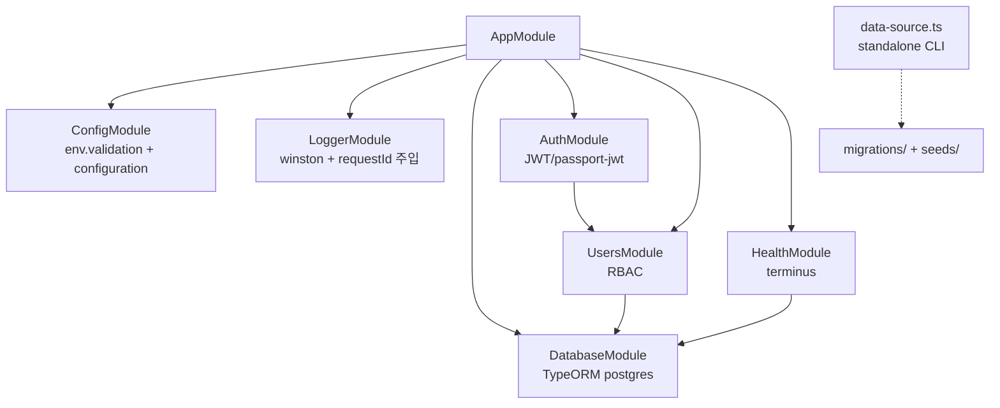

# 아키텍처

모듈 의존·요청 수명주기·검증 경로 등 구조의 정본. 개요 다이어그램은 README, 작업 규칙은
CLAUDE.md·`.claude/rules/` 참고.

## 모듈 의존



- `data-source.ts` 는 앱(TypeOrmModule)과 **분리된 standalone DataSource** — CLI
  (`migration:generate/run`, `seed`)와 e2e globalSetup 이 이것을 기준으로 동작한다.
- `scripts/generate-openapi.ts` 는 DataSource 토큰을 스텁으로 치환해 DB 없이 스펙을 만든다
  (ADR 0004 — 스텁의 `options.type` 은 실제 드라이버와 일치해야 함).

## 요청 수명주기

```text
요청 → helmet/CORS/body limit (main.ts)
     → RequestIdMiddleware (AsyncLocalStorage 에 requestId 시작)
     → 전역 가드: ThrottlerGuard → JwtAuthGuard(deny-by-default) → RolesGuard
     → ValidationPipe(VALIDATION_PIPE_OPTIONS: whitelist+forbidNonWhitelisted+transform)
     → Controller(얇게) → Service(비즈니스 로직) → Repository(TypeORM)
     → ClassSerializerInterceptor(@Exclude 제거) / LoggingInterceptor
     → 예외 시 AllExceptionsFilter 가 표준 에러 형식으로 통일
```

## 검증 경로 이원화 (비자명)

검증이 **두 경로로 나뉘며 설정을 서로 맞추면 안 된다**:

1. **환경 변수 검증**(`config/env.validation.ts`) — 부팅 시 `plainToInstance` + `validateSync` 로
   전역 `ValidationPipe` 와 무관하게 직접 수행. 이 경로엔 implicit 변환이 없으므로 숫자 필드는
   `@Type(() => Number)` 로 명시 변환한다(reflect 메타데이터 의존 제거 → 빌드/테스트 환경 무관).
2. **요청 DTO 검증** — 전역 `ValidationPipe`(`main.ts`)는
   `transformOptions.enableImplicitConversion: true` 를 켠다.

둘을 혼동해 한쪽 설정을 다른 쪽에 맞추지 말 것. Jest 는 `setupFiles: ['reflect-metadata']` 로
데코레이터 메타데이터를 로드한다.

## 경로 별칭 (3중 설정)

`@/*` → `src/*` 는 **세 곳에 설정**되어야 한다:

| 위치        | 설정                                                        |
| ----------- | ----------------------------------------------------------- |
| 컴파일 타임 | `tsconfig.json` `paths`                                     |
| Jest        | `moduleNameMapper` (단위·e2e 설정 각각)                     |
| 런타임      | 빌드: `tsc-alias` / ts-node 실행: `tsconfig-paths/register` |

빌드 스크립트가 `nest build && tsc-alias` 인 이유다(별칭을 dist 에서 상대경로로 치환).

## e2e DB 격리 (testcontainers — ADR 0009)

`test/global-setup.ts` 가 PostgreSQL 컨테이너 기동 → `process.env.DB_*` 주입(워커 fork 전이라
전 워커 전파) → CLI 경로(`pnpm migration:run`/`pnpm seed`)로 스키마·시드 준비. globalSetup
프로세스에서 ts-node require 훅을 등록하면 Jest 트랜스포머와 겹쳐 이중 컴파일이 발생하므로
TypeORM 글롭 로딩 대신 자식 프로세스 CLI 를 쓴다.
